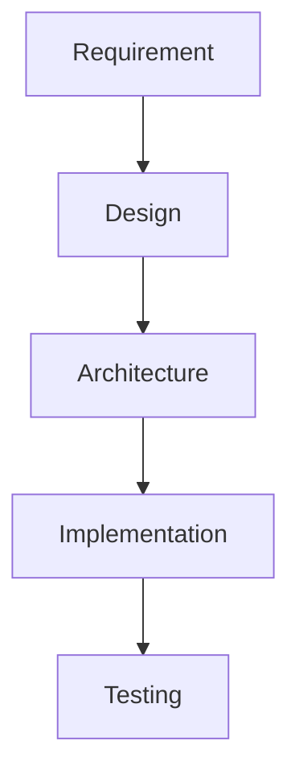
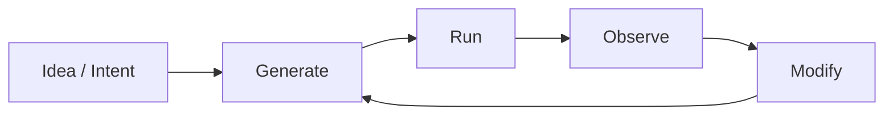
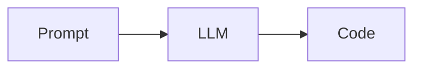
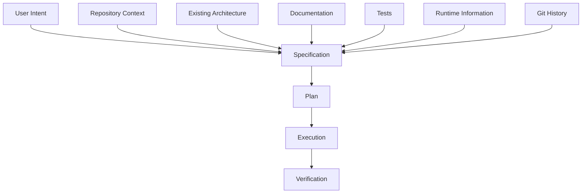
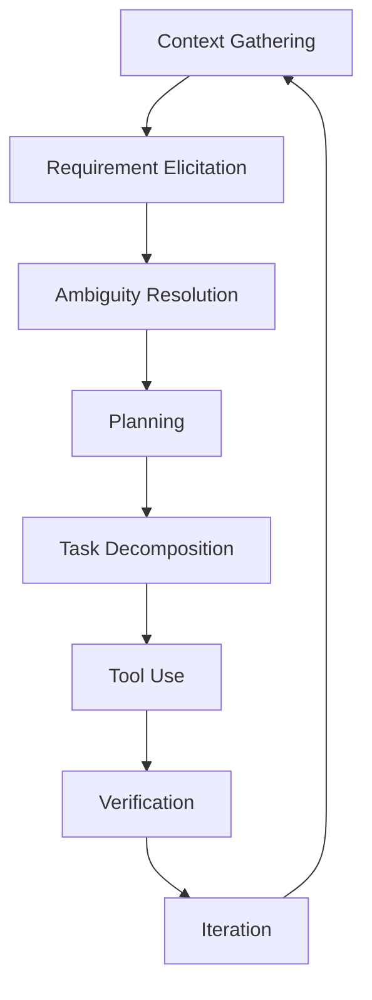
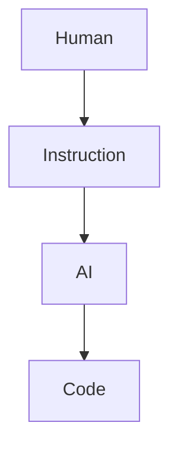
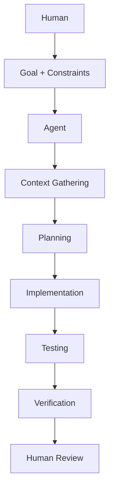
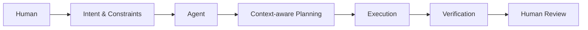

# Vibe Coding 到 Agentic Coding

最近一段时间使用 Codex、Claude Code 以及其他 Coding Agent，我逐渐产生了一个比较强烈的感觉：

**现在的 AI Coding，似乎已经越来越难用 Vibe Coding 来准确描述了。**

这里的问题并不是 Vibe Coding 这个词本身有什么错误。

恰恰相反，如果回到生成式 AI 刚开始大规模进入软件开发的阶段，Vibe Coding 是一个相当准确的描述。它强调的是一种非常低摩擦的开发方式：开发者不需要在开始编码之前完成完整的需求分析、架构设计和技术选型，而是可以从一个相对模糊的意图出发，让模型先生成一个可运行的版本，再通过运行结果和持续对话逐步修正。

这种方式的核心其实不是“AI 写代码”，而是：

**允许软件开发在需求尚未完全收敛的情况下直接开始。**

但现在的 Coding Agent 正在改变这个前提。

越来越多的时候，在真正修改代码之前，Agent 会主动询问问题、读取项目上下文、分析依赖关系、提出实现方案，甚至要求开发者确认某些设计决策。

换句话说，AI 开始介入的已经不只是 implementation，而是 implementation 之前的整个 reasoning process。

这也是我认为 Vibe Coding 正在发生变化的地方。

## Vibe Coding的“低前置约束”

**Vibe Coding ：Vibe常被译为氛围编程。何为氛围编程？当你有一点想法，认为氛围到了，于是开始coding。**

过去我们写一个软件功能，通常会有一个比较明确的前置过程：

即使实际开发过程中不一定严格按照这个顺序进行，但软件工程的基本思想仍然是：**在进入 implementation 之前，尽可能降低需求和设计上的不确定性。**

Vibe Coding 对这个过程进行了弱化。

开发者完全可以从一个模糊的想法直接进入实现阶段，然后利用 AI 极低的代码生成成本，通过不断的反馈循环逐渐逼近最终结果。

因此，Vibe Coding 真正降低的是 **upfront specification cost**。

以前一个想法如果没有形成比较完整的需求描述，很难直接进入工程实现。

现在可以先做出来，再逐渐明确需求。

从这个意义上说，Vibe Coding 并不是一种新的编程语言或者新的技术架构，而更像是一种**以低前置设计成本换取高频反馈的开发模式**。

### Coding Agent 开始约束前置条件

有意思的是，现在的 Agent 又开始重新强调这些东西。

例如你告诉 Agent：

> “给这个项目增加一个配置系统。”

一个简单的代码生成模型完全可以直接开始生成代码。

但一个成熟的 Coding Agent 往往会先检查：

- 当前项目有没有现成的 configuration abstraction；
- 配置来源是环境变量、配置文件还是远程配置中心；
- 当前模块之间如何传递 configuration；
- 是否存在 backward compatibility 要求；
- 测试框架和现有测试覆盖情况；
- 哪些模块真正需要修改。

如果需求存在歧义，它还可能直接停下来询问：

> “这个配置应该在启动时读取一次，还是运行时动态 reload？”

这件事情看起来只是“AI 变得更爱提问”。

实际上背后发生的是一个更重要的变化：

**Agent 开始主动进行 requirements elicitation 和 ambiguity resolution。**

也就是说，模型不再把用户输入直接当成完整 specification，而是开始判断：

> 当前信息是否足以安全地执行这个任务？

如果不足，就主动补充信息。

这是一个非常重要的能力变化。

### 以前的模型默认“Prompt 就是 Specification”

传统的 LLM Coding 可以简单理解成：

Prompt 在这里实际上承担了 specification 的角色。

开发者告诉模型：

> “实现一个 XXX。”

模型就根据上下文推断如何实现。

这种模式的一个天然问题是：

**自然语言需求通常是不完备的。**

开发者自己知道的一些约束，可能根本没有写进 Prompt。

例如：

> “增加一个用户删除功能。”

这句话看起来非常明确，但实际工程中至少可能涉及：

- hard delete 还是 soft delete；
- 是否删除关联数据；
- 是否需要审计日志；
- 删除之后 token 是否立即失效；
- 是否允许管理员删除自己；
- API 是否需要保持 backward compatibility；
- 是否需要事务；
- 是否存在异步清理任务。

这些信息如果没有进入上下文，模型只能进行概率意义上的补全。

因此，早期 AI Coding 的一个典型问题就是：

**模型生成了“合理的代码”，但并没有生成“符合项目真实约束的代码”。**

## Agent 开始把 Prompt 和 Specification 区分开

我认为现在的 Coding Agent 与普通代码生成模型最大的区别之一，就是它开始意识到：

> **User Prompt ≠ Complete Specification**

Prompt 只是任务入口。

真正的 specification 需要从多个地方获得：

这也是为什么现在的 Agent 会大量读取文件、搜索代码、检查配置、查看测试，甚至分析 Git diff。

它实际上是在进行一种 **context gathering**。

对于一个 Agent 来说，代码库本身就是一种非常重要的 specification。

有时候，用户说：

> “给这个模块加一个缓存。”

而 repository 中已有的接口、命名方式、依赖关系和测试，实际上比这句话本身包含了更多的约束。

所以现在的 AI Coding 已经越来越不是：

> **Prompt → Code**

而是：

> **Intent + Context → Plan → Execution → Verification**

### Agent 像一个工程师

当 Agent 开始处理完整的软件任务之后，它需要解决的问题就不再只是代码生成。

它需要完成至少几个不同阶段：

这些阶段分别对应：

1. **Context Gathering**：理解 repository、模块结构、依赖关系、已有实现和测试。
2. **Requirement Elicitation**：识别需求中缺失的信息。
3. **Ambiguity Resolution**：发现多个合理实现之间存在歧义，并请求用户进行决策。
4. **Planning**：根据目标和约束制定 implementation plan。
5. **Task Decomposition**：把一个高层任务拆成多个可以执行的子任务。
6. **Tool Use**：通过搜索、编辑、执行命令、运行测试等工具与真实开发环境交互。
7. **Verification**：通过测试、lint、type check、运行结果甚至 diff review 判断修改是否满足要求。
8. **Iteration**：发现失败之后重新定位问题并修正。

这些能力组合起来，已经明显超出了传统意义上的 code generation。

所以我现在更愿意把这一阶段称为：

**Agentic Software Engineering。**

## 人的角色

如果 AI 只是代码生成器，那么人与 AI 的关系很简单：

人主要负责告诉 AI 怎么做。

但如果 AI 成为了 Agent，关系开始变成：

开发者提供的东西开始从 **implementation instruction** 转向 **intent and constraints**。

这并不意味着程序员不需要技术能力。

恰恰相反。

当 Agent 可以独立处理越来越多 implementation work 之后，真正重要的能力会越来越集中到：

- 问题建模；
- 系统设计；
- 架构判断；
- 约束定义；
- 风险识别；
- 代码 review；
- 对 Agent 输出进行验证。

也就是说，人的工作从“怎么写”逐渐向“为什么这样写”以及“应该不应该这样写”移动。

### Agentic Coding ≠ Vibe Coding

如果把现在的 AI Coding 统称为 Vibe Coding，我觉得实际上掩盖了一件很重要的事情。

Vibe Coding 的核心是：

> **降低开始编码的门槛。**

而 Agentic Coding 的核心则是：

> **降低完成软件工程任务的成本。**

前者解决的是：

> “我有一个想法，如何快速把它做出来？”

后者解决的是：

> “我有一个工程目标，如何让 Agent 在真实代码库中完成它？”

两者的 abstraction level 并不一样。

前者主要发生在 **code generation** 层面。

后者已经进入 **software engineering workflow**。

因此，与其说 Agentic Coding 是 Vibe Coding 的一个升级版，我更倾向于认为：

**Vibe Coding 是生成式 AI 进入软件开发之后形成的一种早期开发范式，而 Agentic Coding 正在把 AI 从代码生成工具推进到软件工程执行者。**

## AI 越强越需要梳理边界

这也是我最近使用 Coding Agent 时最明显的感受。

模型能力提高以后，我原本以为它应该越来越少问问题。

实际却恰恰相反。

**越强的 Agent，有时候越喜欢在执行之前确认问题。**

这并不是因为它不会写代码。

而是因为它开始知道：

> **哪些问题不能靠自己猜。**

这其实是 Agent 和传统代码生成模型之间非常重要的区别。

一个普通模型面对 ambiguity，通常会进行 implicit assumption：

> “我猜你想要的是 A，所以我直接实现 A。”

而一个更成熟的 Agent 会把这个 ambiguity 显式化：

> “A 和 B 都是合理方案，但两者会导致不同的系统行为，我需要你确认。”

从软件工程角度看，这反而是一种成熟。

因为工程开发最怕的不是“不知道”，而是：

**在不知道的情况下自作主张。**

## Vibe Coding 不会

我并不认为 Vibe Coding 会消失。

对于个人项目、prototype、一次性工具以及探索性开发，它依然非常有效。

尤其是在需求本身就不稳定的时候，直接让 AI 做一个 prototype，然后通过实际使用来反推需求，可能比先写完整 specification 更高效。

但在成熟的软件项目中，AI Coding 正在呈现出完全不同的形态。

Agent 需要理解 repository。

需要遵循 existing conventions。

需要考虑 backward compatibility。

需要修改多个模块。

需要运行测试。

需要处理失败。

需要在关键决策上与开发者进行确认。

这已经不是单纯的“vibe”了。

它更接近一种新的软件工程工作流：

如果一定要给这个阶段找一个更准确的名字，我会倾向于：

**Agentic Software Engineering**

而不是简单地继续把它称为 Vibe Coding。

Vibe Coding 代表的是：

**“让 AI 把我的想法做出来。”**

而 Agentic Software Engineering 代表的是：

**“让 AI 理解我的工程目标，并在真实的软件工程环境中完成它。”**

这两者之间的差异，可能比“AI 会不会写代码”本身更加值得关注。

因为当代码生成已经逐渐变成一种基础能力之后，真正的竞争点就不再只是：

**谁写代码更快。**

而是：

**谁能够更准确地理解意图、获取上下文、处理约束、进行规划，并最终验证软件是否真正完成了它应该完成的事情。**

